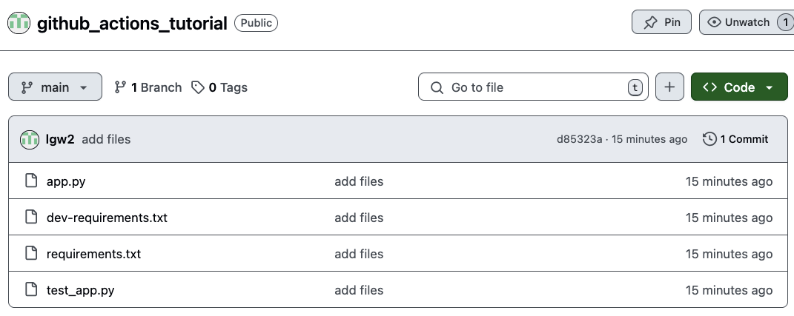

get files. if you want to test that the tests are working, you should either set up a conda environment or a python `venv` to install the dependencies. so do one of the below, and then proceed to run tests locally:

### conda instructions

```
conda create --name github_actions_tutorial
conda activate github_actions_tutorial
conda install pip
pip install -r requirements.txt
```

### pip venv instructions

todo

### run tests locally

```
python -m pytest
```

ask for help if these don't pass

### make a new github repo and push your files

on browser, should look like this



### set up github actions to run test automatically on pull request

We'll do a few things here. To set up our needed github action, we really just need to add the correct file to our repository in the correct place. But we will practice using git branches along the way.

The "proper" way to contribute to a git repository is through the branch, merge, pull request framework.

So we will create and switch to a branch called add-gha:
```
git checkout -b add-gha
```

We will then add the file `.github/workflows/unit-tests.yml` (notice that you may need to make some new directories here) with content (you can copy-paste this by finding this file on the tutorials repo):

```
name: Python Unit Tests

on:
  pull_request:
    branches:
    - main

jobs:
  build:
    runs-on: ubuntu-latest

    steps:
    - uses: actions/checkout@v2
    - name: Set up Python
      uses: actions/setup-python@v4
      with:
        python-version: '3.13'
    - name: Install dependencies
      run: |
        python -m pip install --upgrade pip
        python -m pip install -r requirements.txt
        python -m pip install -r dev-requirements.txt
    - name: Test with pytest
      run: |
        pytest --verbose
```

then add and commit your files.

Then push:

```
git push origin add-gha
```

Then go to your repo on GitHub and create pull request and merge. Now you should have your github actions file, and the test should run!

